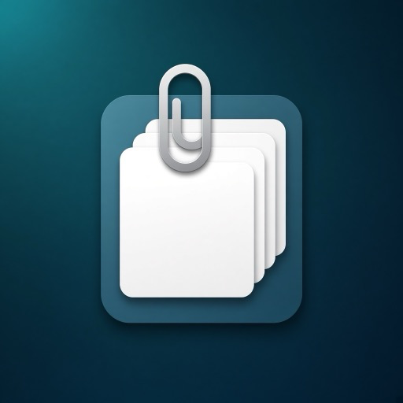
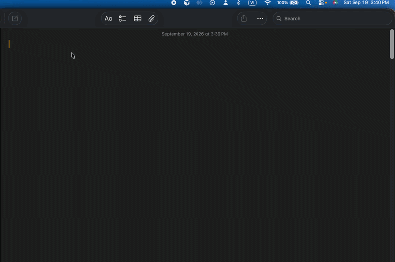

<p align="center">
  
</p>

<h1 align="center">CopyStack</h1>

<p align="center">
  Menu bar clipboard stack for macOS.<br />
  Copy several times, then pick <strong>Copy 1 / Copy 2 / Copy 3…</strong> with <strong>⌘⇧V</strong>.
</p>

Requires macOS 13+. **Not notarized** — Apple will show a malware warning. That warning cannot be removed without a paid Apple Developer account.

## Install

Download **[CopyStack.app.zip](https://github.com/codedeman/CopyStack/releases/latest)**.

**Easiest path:** unzip, then double-click **Install.command**. If macOS blocks it, right-click → **Open**. The script clears quarantine and copies the app into Applications.

**If you still see a malware warning (macOS 15+):**

1. Open **System Settings → Privacy & Security**.
2. Scroll down and click **Open Anyway** next to CopyStack.
3. Enter your Mac password.

Or in Terminal:

```bash
xattr -cr /Applications/CopyStack.app
```

Then **Privacy & Security → Accessibility** → **+** → `/Applications/CopyStack.app`.

See `INSTRUCTIONS.txt` inside the zip for the same steps.

## Usage

- **⌘V**: paste the newest item (unchanged).
- **⌘⇧V**: pick Copy 1 / 2 / 3… (**1–9**, **↑↓** + Enter, or click). Esc closes the overlay.

<p align="center">
  
</p>
